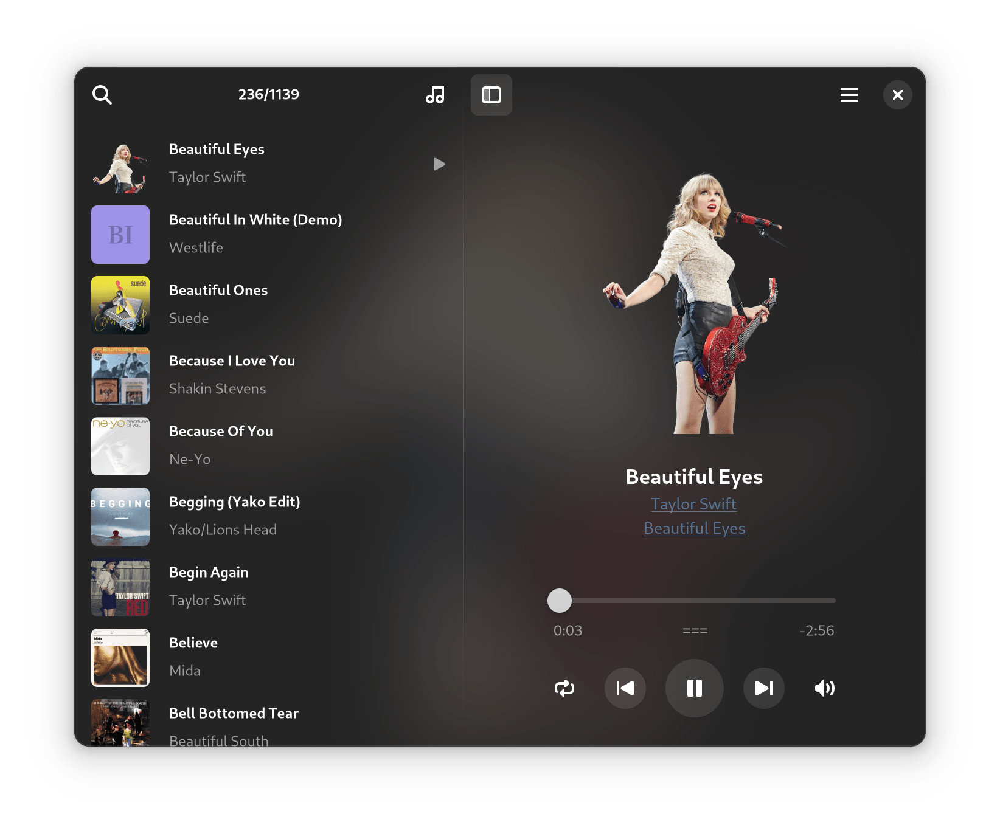

# G4Music

Play your music, in elegant way.

A fast, flurent, light weight music player written in GTK4, with a beautiful, modern user interface, so named G4Music.

## Features
- Supports most music file types, samba and any other remote protocols (thanks to great GIO and GStreamer).
- Fast loading and parsing hundreds of music files, in less than 1 second.
- Low memory usage for large playlist with album covers, no thumbnail caches to store.
- Sort by album/artist/title or shuffle, supports full-text searching.
- Album cover is original resolution, can be exported.
- Gaussian blurred cover as window background. 
- Follow GNOME 42 light/dark mode.
- Supports MPRIS control.
- Supports drag-drop from file manager.
- Supports pipewire audio sink.
- Show dynamic audio peak when playing.
- All these in a small package less than 300KB.

## Install from Flathub

## How to build 
It is written in Vala, simple and clean code, with few third-party dependencies:

1. Clone the code from gitlab.
2. Install vala, develop packages of gtk4, libadwaita, gstreamer.
3. Run in the project directory:

    `meson setup build`

    `meson install -C build`

## About this project
I was inspired by [Amberol](https://gitlab.gnome.org/World/amberol) when I started to learn program with GTK4, I found it is so convenient to write code in Vala language: handle signal with closure, async tasks, easy to compile with C code, similar with programming in Kotlin on Android.
