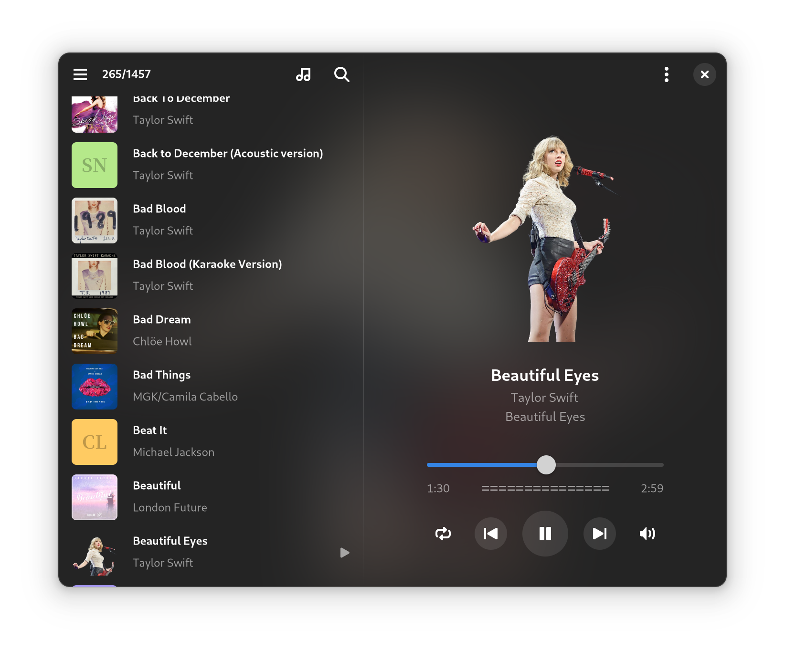
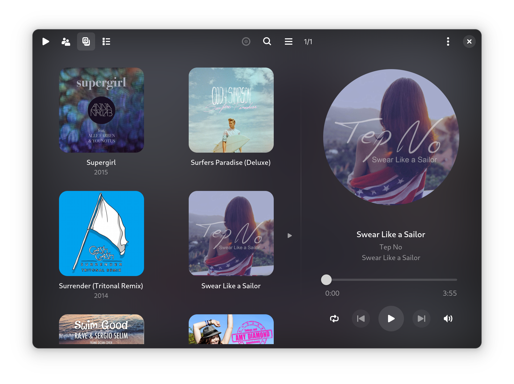
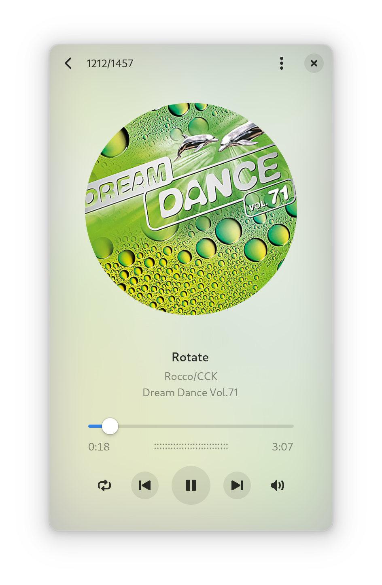
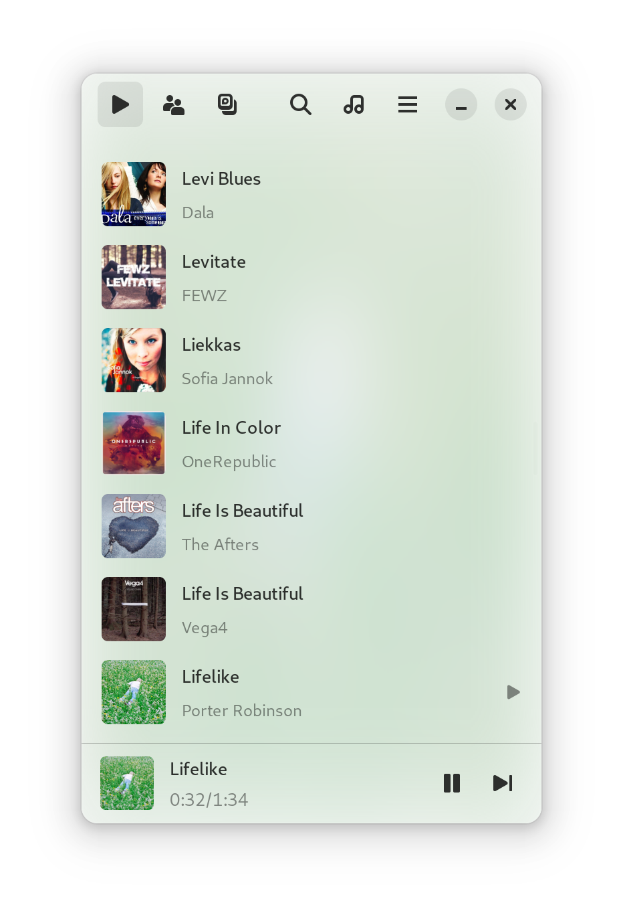

# G4Music
Play your music elegantly.






G4Music is a fast fluent lightweight music player written in GTK4, with a beautiful and adaptive user interface, focuses on high performance for large music collection.

## Features
- Supports most music file types, samba and any other remote protocols (depends on GIO and GStreamer).
- Fast loading and parsing thousands of music files in very few seconds, monitor local changes.
- Low memory usage for large music collection with album covers (embedded and external), no thumbnail caches to store.
- Group and sorts by album/artist/title, shuffle list, full-text searching.
- Gaussian blurred cover as background, follows GNOME light/dark mode.
- Drag-drop from GNOME Files, showing music in Files.
- Supports audio peaks visualizer.
- Supports gapless playback.
- Supports normalizing volume with ReplayGain.
- Supports pipewire and other audio sink.
- Supports MPRIS control.
- Only need less than 500KB to install.

## Install from Flathub
<a href="https://flathub.org/apps/com.github.neithern.g4music">
</a>

## Install from Snapcraft (unofficial)
<a href="https://snapcraft.io/g4music">
 

## FreeBSD Dependencies

```bash
pkg install vala meson libadwaita gstreamer1-plugins-all gettext gtk4
```

## How to build 
It is written in Vala, simple and clean code, with few third-party dependencies:

1. Clone the code from gitlab.
2. Install vala, develop packages of gtk4, libadwaita, gstreamer.
3. Run in the project directory:

    `meson setup build --buildtype=release`

    `meson install -C build`

## Change Log
Check the [release tags](https://gitlab.gnome.org/neithern/g4music/-/tags) for change log.
